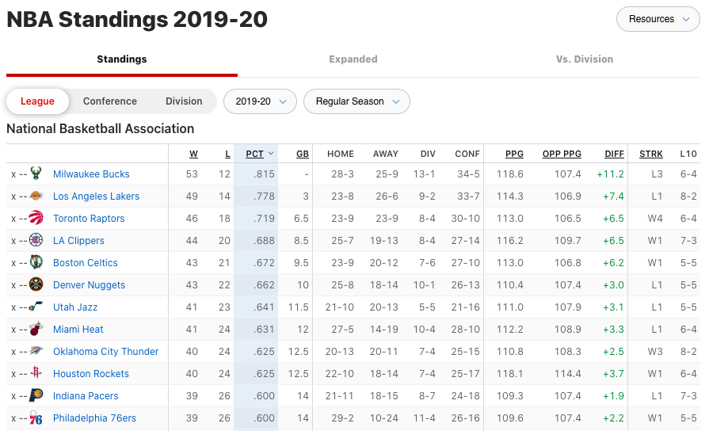
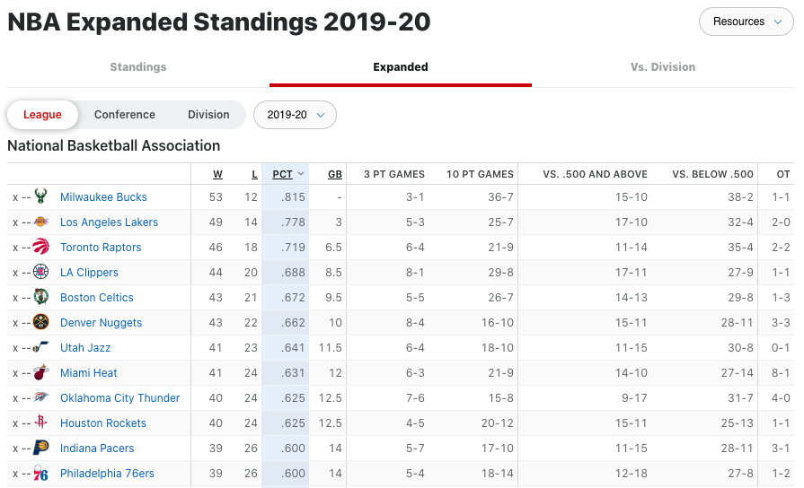
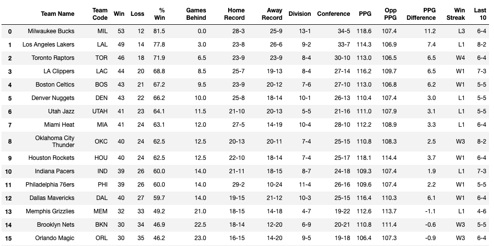
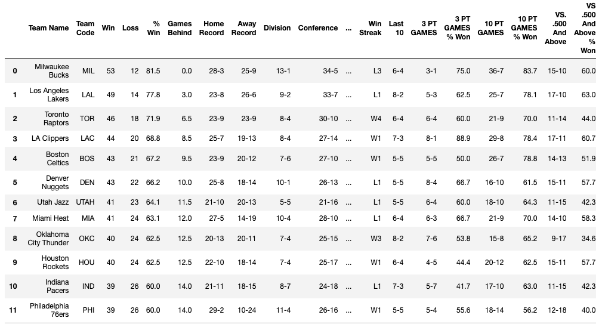
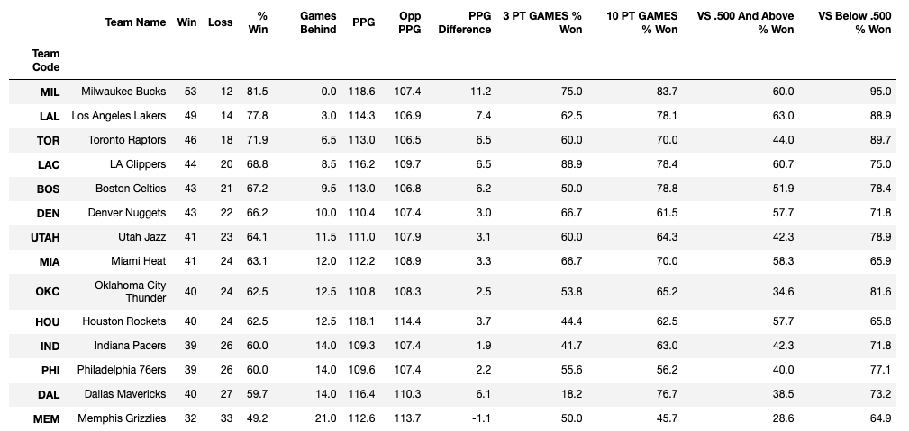
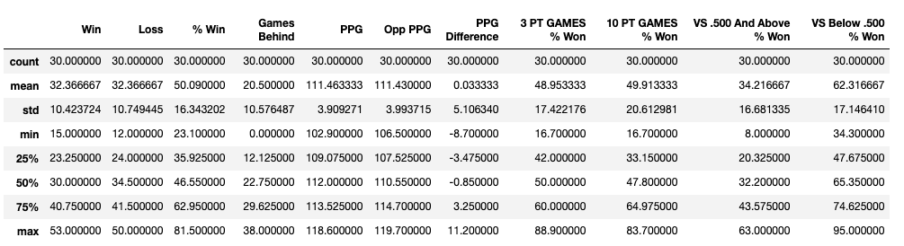
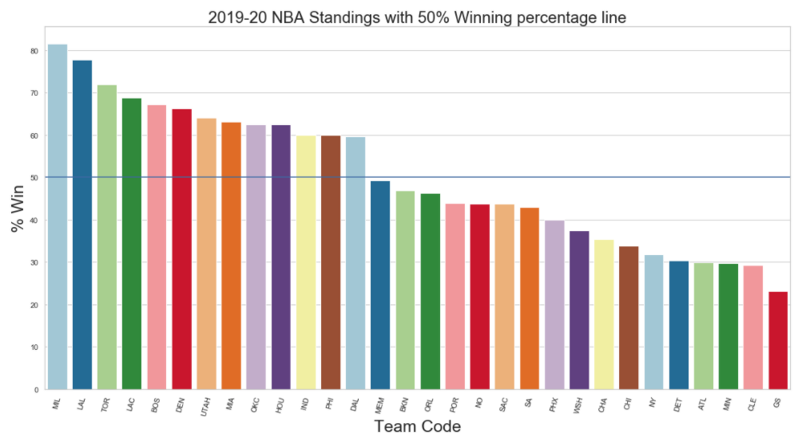
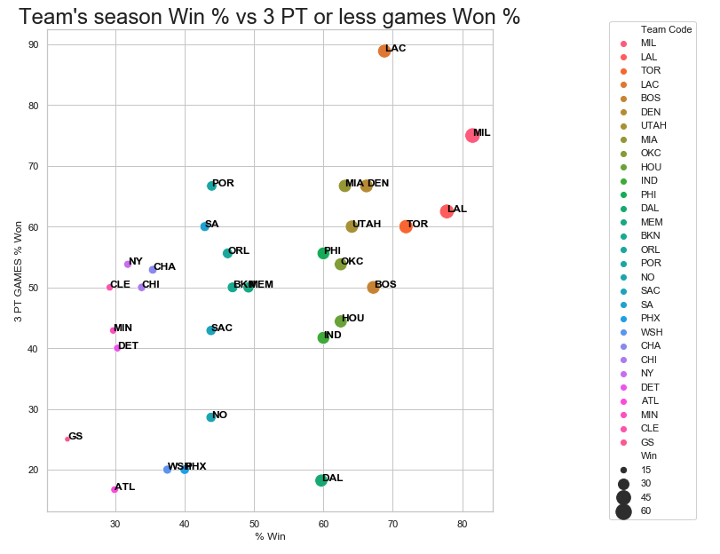
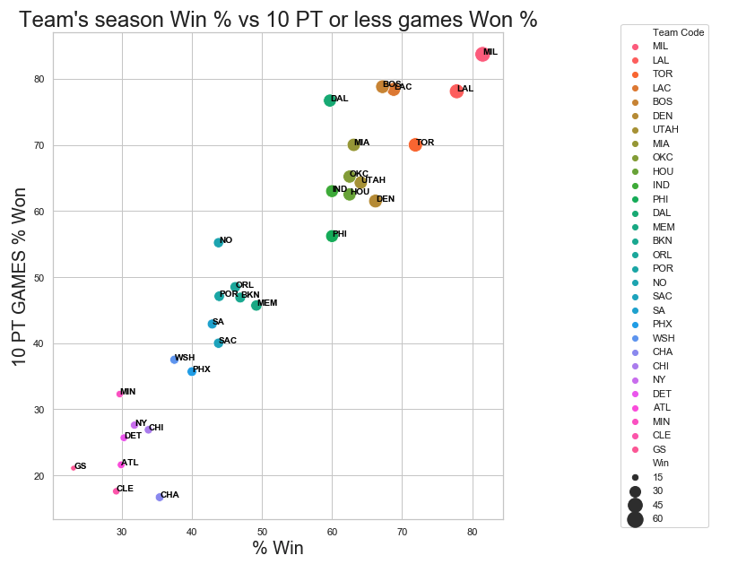
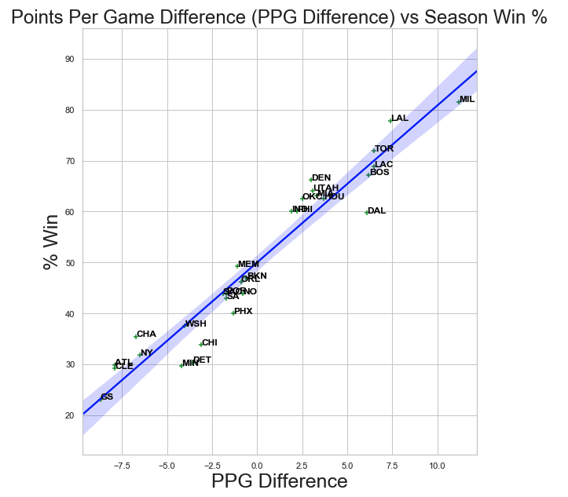

# ESPN NBA Standing 2019-2020 Analysis Using BeautifulSoup, Pandas DataFrame and Seaborn Visualization

This is a mini project that incorporates Webscraping using BeautifulSoup, importing into Pandas DataFrame and using Seaborn to show visualization of scraped data. 
The data was scraped from ESPN website under NBA Standings for the season of 2019-2020, specifically the League Standings. 
Website: http://www.espn.com/nba/standings/_/group/league 

### Sample view of data table in ESPN NBA Standings website : Regular 

### Sample view of data table in ESPN NBA Standings website: Expanded 

### BeautifulSoup was used to scrape the data from the League Standings regular/expanded table and imported into Pandas DataFrame. 
#### Sample of data scraped from regular standings

### The data was then cleaned and calculations were made such as 3 PT GAMES % Won, 10 PT GAMES % Won, etc. 
### Both dataframe (regular and expanded) were joined together. This is a sample image of the resulting dataframe.

### This dataframe was further reduced to the final dataframe with columns containing numerical values. 

### This is an image of a table showing information about the dataframe

## Using Seaborn as Visualization Tool using Pandas DataFrame

### 1) Seaborn Bar Plot showing Team and Winning Percentage for the season in a descending order from left to right

#### This plot shows the winning percentage of each team for the 2017-2018 season

### 2) Seaborn Scatter Plot showing the relationship between Season Win % vs Percentage of Wins where score difference was less than 3. This shows how teams are playing in very close games.
#### This plot shows that teams with high win rate during the season has much higher percentage of winning very close games compared to teams that have low win rate.

### 3) Seaborn Scatter Plot showing the relationship between Season Win % vs Percentage of Wins where difference in score was 10 points or less. 
#### This plot shows a clearer relationship between the Win % and how teams fare in games where the games are somewhat close. This chart clearly shows that teams with high season Win % on average wins 60% or greater on games that are decided within 10 points. 

### 4) Seaborn Regression Plot showing the relationship between points scored by the team (PPG Difference) vs Season Win % with a regression line
#### This plot shows the linear relationship between how many points per game a team wins or loses on average by and how it translates in season winning percent

## This was a mini project utilizing BeautifulSoup, Pandas DataFrame, and Seaborn Visualization to analyze the NBA Standing for 2019-2020 season. 
 
## This project was done to show my abilities in using Python, BeautifulSoup, and Pandas.
### 1) Data was scraped from ESPN using BeautifulSoup and Python
### 2) Data was imported into Pandas and cleaned
### 3) Using Seaborn, various data analysis was made in addition to creating plots such as Scatterplot and Regression plot

### Further analysis can be done using this dataset but this project was just to show a sample of work that can be done. Interesting project would be to scrape all player data or gameplay data and doing further analysis. Machine Learning can be used to predict what kind of attributes will give an insight into how a player will play in the future
