## Current Sales & Price Statistics for California Realtor Single-Family Home Sales in May 2020 from publicly available data

#### Source: https://www.car.org/marketdata/data/countysalesactivity

### Month to Month (Apr-2020 / May-2020) and Year to Year (May-2019 / May-2020) Price Change and Number of Sales Change for San Francisco Bay Counties and Southern California Counties 

#### Los Angeles Metropolitan Area is a 5-county region that includes : **Los Angeles County, Orange County, Riverside County, San Bernardino County, and Ventura County**

#### San Francisco Bay Area has been redefined to include the following counties : **Alameda, Contra Costa, Marin, Napa, San Francisco, San Mateo, Santa Clara, Solano, and Sonoma**

#### *   MTM% Chg = Percent change from prior month
#### *   YTY% Chg = Percent change from prior year  

### Sample Raw Excel Data of Single Family Homes Sales and Price Change

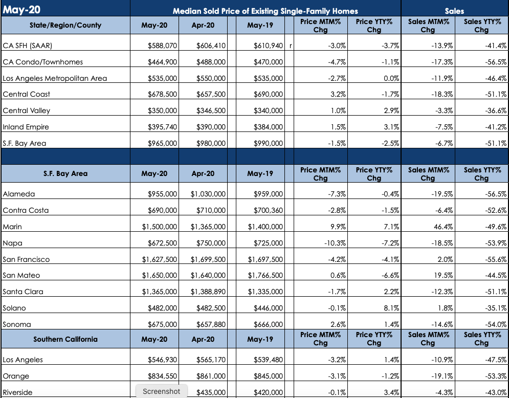

---

### Data is dirty when we load into pandas so we have to clean them up. First we need to pick out the dataframe where it has SF Bay Area and SO Cal data

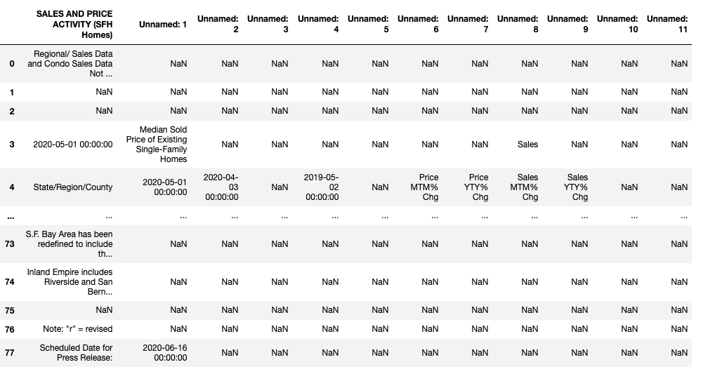

---

### SF BAY AREA : ANALYSIS AND VISUALIZATION OF EXISTING SINGLE-FAMILY HOMES

---

### SAN FRANCISCO BAY COUNTIES 
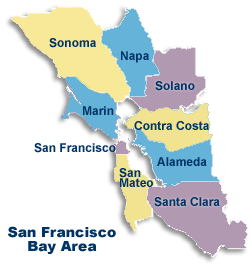

#### Import data into Pandas Data Frame and isolating San Francisco Bay Counties 

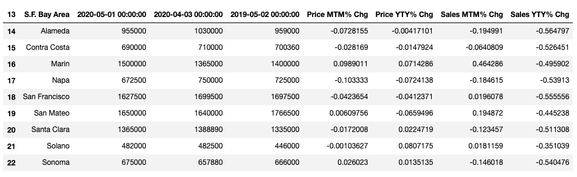

---

#### Clean Up Data : Remove 'nan', change column names, multiply % by 100 to make it out of 100%, change significant figures on % change 
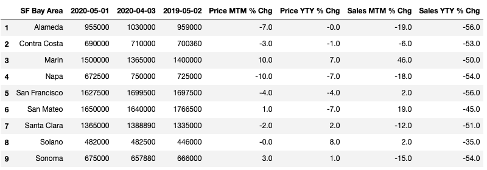

---

#### Add headers for the two categories (*Optional for presentation purposes)
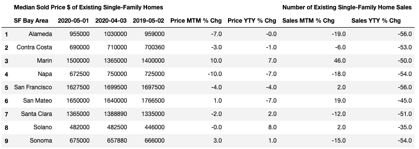

---
### 1 - Year to Year Median Sold Price (May-2019 / May-2020)
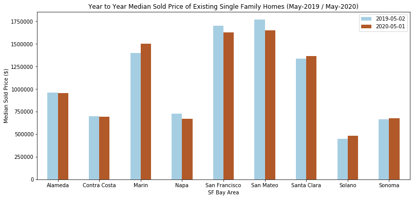

#### Price has risen for some and fell for other counties of SF Bay area from May 2019 to May 2020 
---

### 2 - Year to Year Median Sold Price Change % (May-2019 / May-2020)
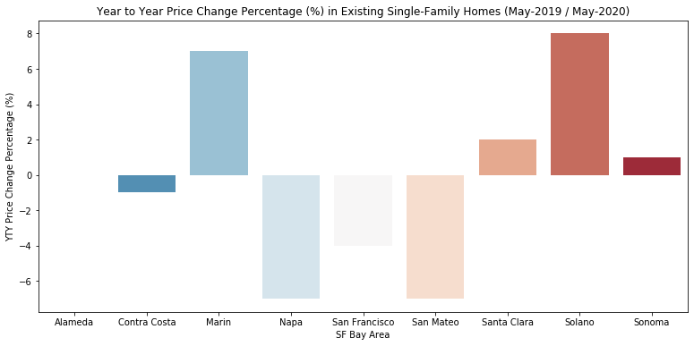

#### Some counties like Marin and Solano saw 7%+ increase in price while others such as Napa and San Mateo saw declines of 6%+ 
---

### 3 - Year to Year % Change in Sales (May-2019 / May-2020)
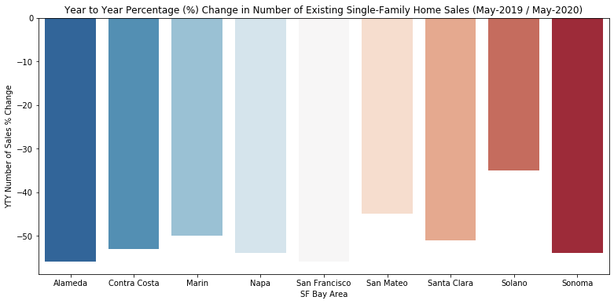

#### On a Year to Year basis, all counties suffered 30% or more decrease in number of sales. Some counties saw more than 50% decline

---

### 4 - Month to Month Median Sold Price (Apr-2020 / May-2020)

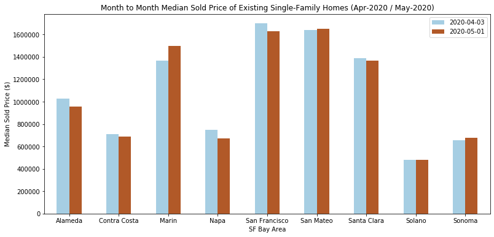

#### On a Month to Month basis, some counties saw an increase while others saw a slight decrease. 

---

### 5 - Month to Month Median Sold Price Change % (Apr-2020 / May-2020)
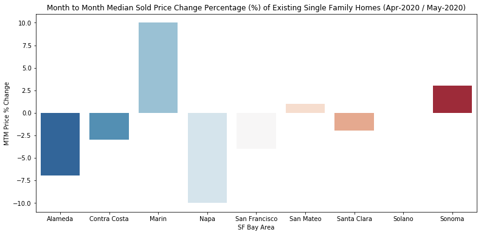

#### On a Month to Month basis, several counties saw a price decrease of more than 2.5% while a county such as Marin saw an increase of around 10% 
---

### 6 - Month to Month Sales Change %  (Apr-2020 / May-2020)
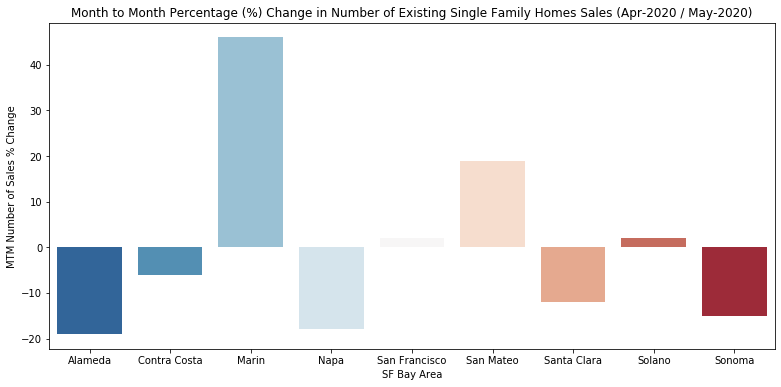

#### Overall, most counties saw a decrease in number of sales with about 4 counties showing greater than 15% loss in sales. However, Marin county had 40%+ increase in sales while San Mateo also saw an incease of around 20%
---
### SOUTHERN CALIFORNIA AREA : ANALYSIS AND VISUALIZATION OF EXISTING SINGLE-FAMILY HOMES
---
### SOUTHERN CALIFORNIA COUNTIES 
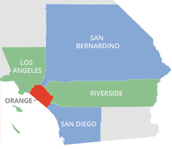

### Import data into Pandas Data Frame and isolating SoCal Counties 

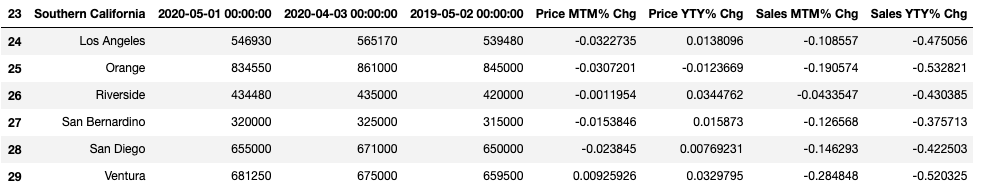

---

### Clean Up Data : Remove 'nan', change column names, multiply % by 100 to make it out of 100%, change significant figures on % change 

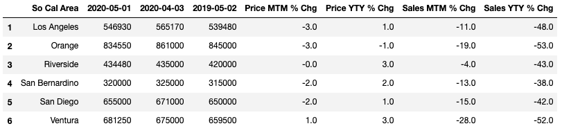

---
### Add headers for the two categories

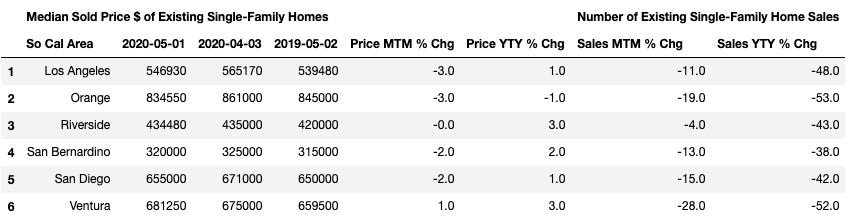

---
### 7 - Year to Year Median Sold Price (May-2019 / May-2020)

#### Price has risen for almost all counties of SoCal area from 2019 to 2020 except for Orange County which decreased slightly

---
### 8 - Year to Year Median Sold Price Change % (May-2019 / May-2020)
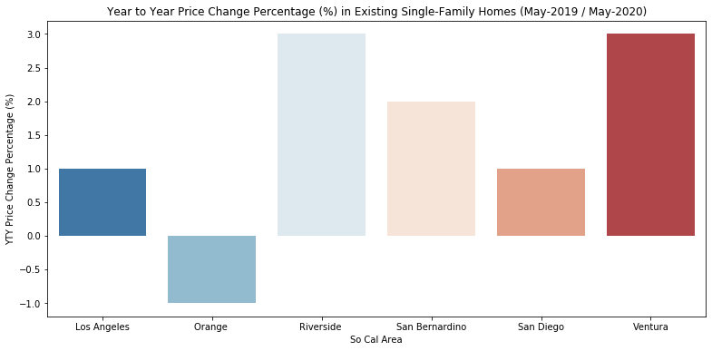

#### All counties except Orange County saw an increase in sold home prices Year over Year. Orange County saw a decline of around 1% in home prices

---
### 9 - Year to Year % Change in Sales (May-2019 / May-2020)
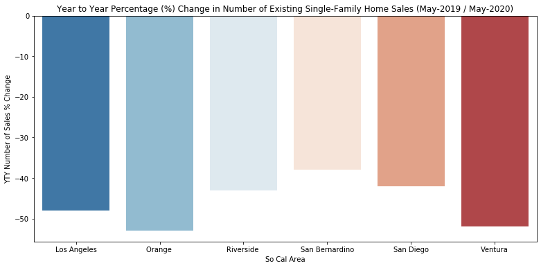

#### On a Year to Year basis, all counties saw a decrease in number of home sales. Some counties such as Orange and Ventura experience more than 50% decrease in sales. 

---
### 10 - Month to Month Median Sold Price (Apr-2020 / May-2020)
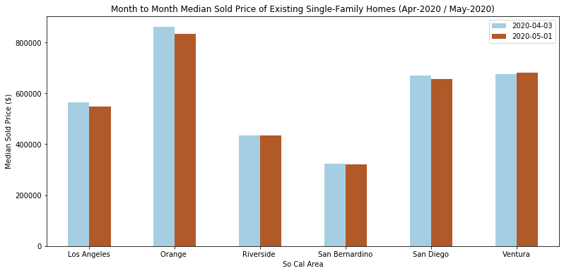

#### On a Month to Month basis, almost all counties experienced decrease in sold prices.

---
### 11 - Month to Month Median Sold Price Change % (Apr-2020 / May-2020)
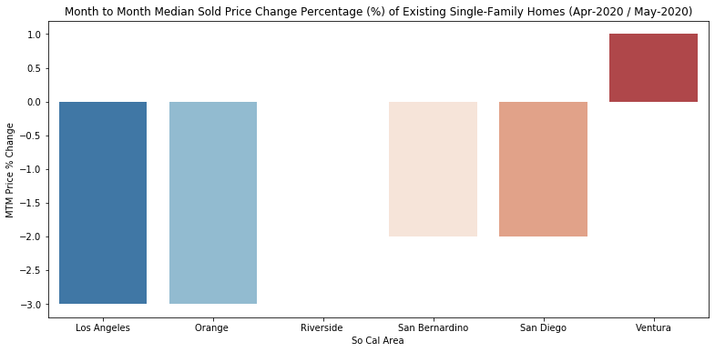

#### Almost all counties saw a decrease 2% or more on home prices on a Month to Month basis. Riverside saw no change while Ventura County saw a slight increase. 

---
### 12 - Month to Month Sales Change %  (Apr-2020 / May-2020)
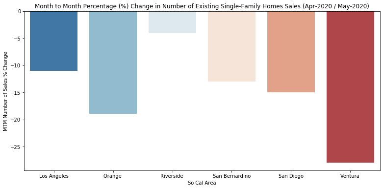

#### On a Month to Month basis, all counties in Southern California saw a decrease in number of home sales with Ventura County having the biggest decline at around 30%.

---

#### The Year to Year graphs clearly show that both SF Bay and So Cal areas are experiencing a slowdown in Single Family Home Sales. 

### This was a mini project in taking an Excel data sheet from the California Realtor's Association website showing YTY and MTM data of various counties all over California 

#### - For the purpose of keeping this project short, Central California Counties and many other Counties including Central Valley and Inland Empire were not included 

#### - The purpose of this mini project was to show how one can take an Excel data sheet from a data source, import and clean up the data using Pandas DataFrame, and using Matplotlib / Seaborn Visualization to create visual plots of the said data in order to be able to visually identity trends and information that's not readily visible just by looking at numbers 

#### - Future Data Analysis would include looking at all the counties, seeing the difference in counties and determining which counties had overall increase or decrease in Price Change and % change in Price and Number of Single Family Home Sales. Further analysis can be given to include changes in Condos, and Apartment building otherwise known under category of Residential Income Properties 
