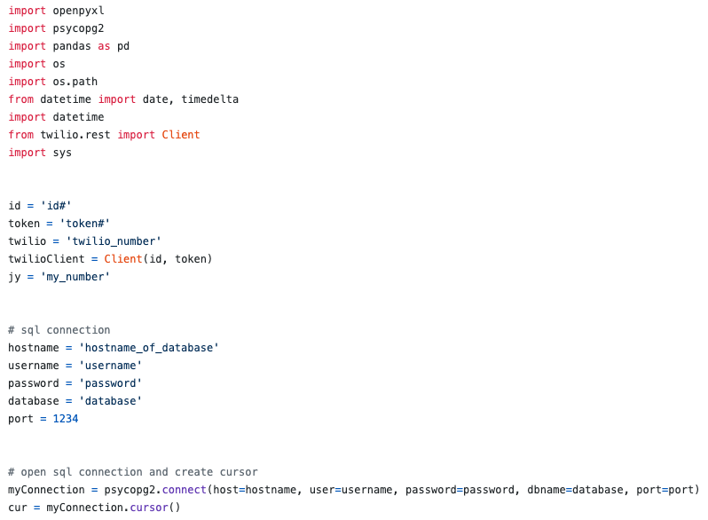
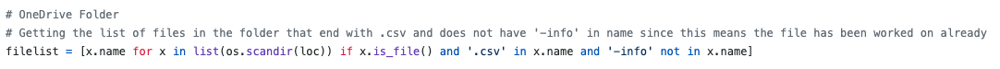
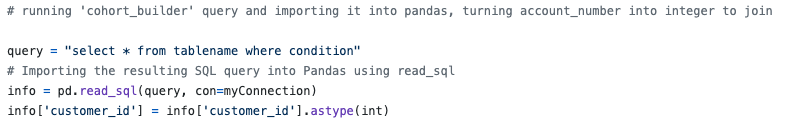
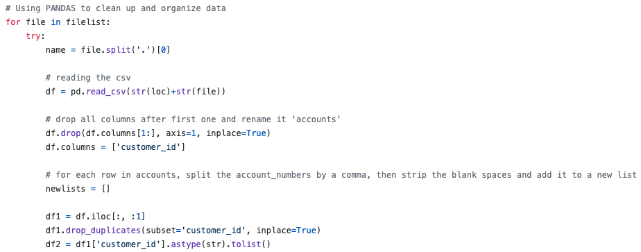
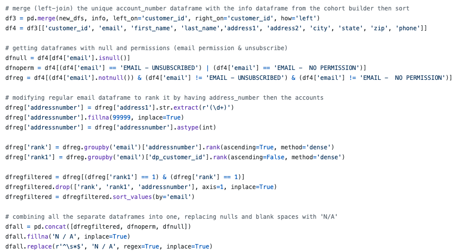
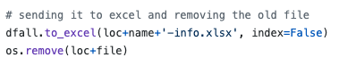
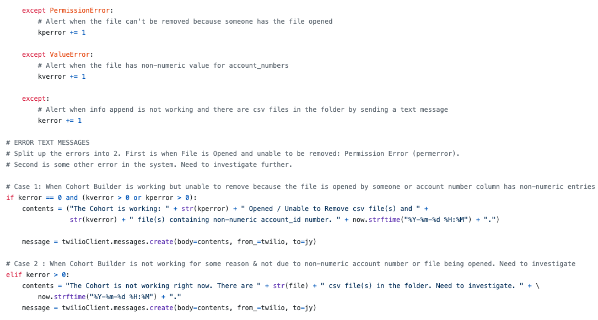
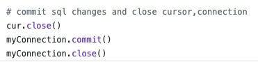

# COHORT BUILDER ( PYTHON, PANDAS, SQL, TWILIO, EXCEL )

## This is a sample of a script I built to append PII (Personal Identifying Information) to  a list created from a SQL query. It also sends a text message if there are any issues.
### Any private information have been replaced with a generic value. Variable names have been changed to generic names. 

## Process
### 1. Setup
#### * Import required Python modules and connect to database (PostgreSql) using Psycopg2.
#### * Set folder location and get files in the folder which has '.csv' in filename and no '-info' in filename (this means it has been processed)
 
### 2. Query the database using SQL to get targeted list of account numbers 
#### * It is much more cumbersome and long to query the database using SQL through Python Pandas. It is much more efficient querying the database directly through a SQL
#### * The query on this script is done on a view that was already created in the database. The view itself gathers specific information from various tables into one table that can be queried whenever we want. If we were to use SQL to get information from all the source tables in this post, it would be very very long.

### 3. Import the query result into Pandas for data cleaning and organizing. 
#### * Each file in the folder is iterated through and processed
#### * Data cleaning such as turning strings into integers where needed, replacing null values with 0, removing duplicates, etc. 
 
### 4. Export the resulting Pandas Dataframe to Excel and remove the file from the folder
#### * Using <b>to_excel</b> to export to Excel. You can also export to CSV using <b>to_csv</b>
#### * Original file is removed from the folder so not to clutter up the hard drive

### 5. Send a SMS text message to a phone number listed if there are any issues 
#### * If errors arise, they are counted and saved. This script takes into account Permission Error, Value Error and any other errors. 
#### * If the file is unable to be removed after processing due to it being currently opened by someone (Permission Error) or if there is a non-numeric data on a numeric only column (Value Error), then a text message will be sent with the information. 
#### * If the file has other errors (which means script is not working at all), it willl send a generic message stating that the issue needs to be further investigated

### 6. Close the connection to the database 

## This script allowed us to pull a list of target customers from the database, append PII to the result and export it to Excel so it can distributed to appropriate parties. This was used to support different departments within the company to efficiently market and target customers that fit the parameters of their conditions. 
 
