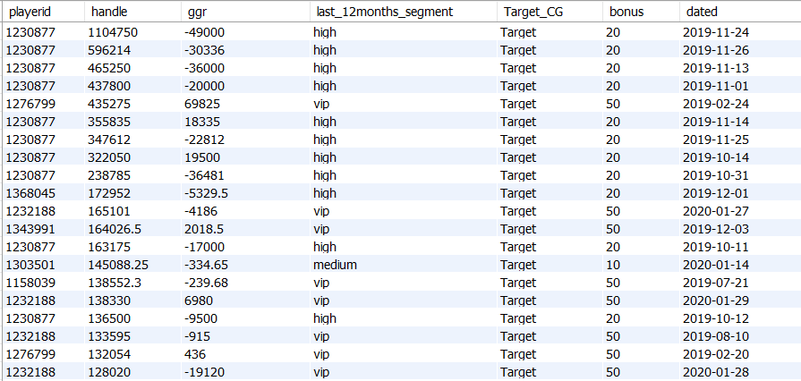
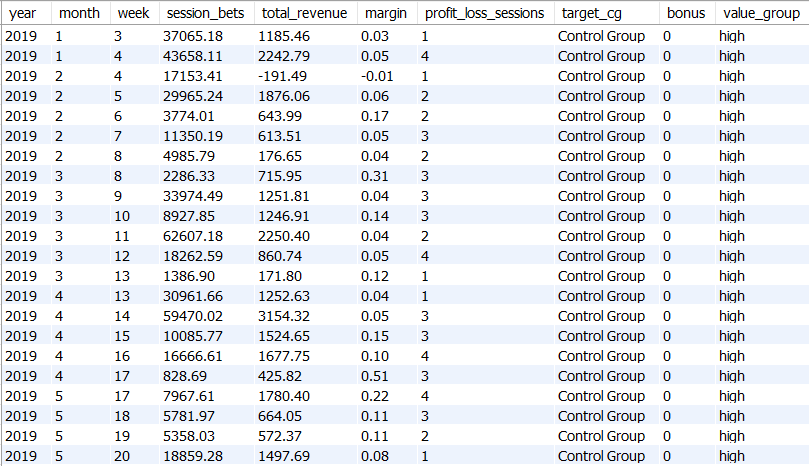
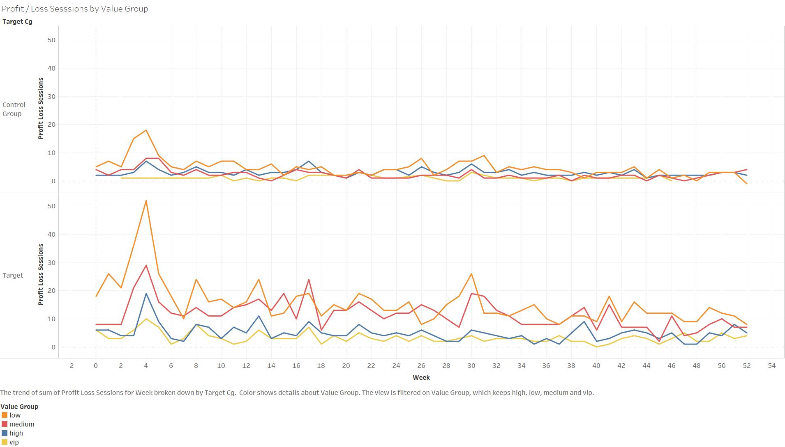
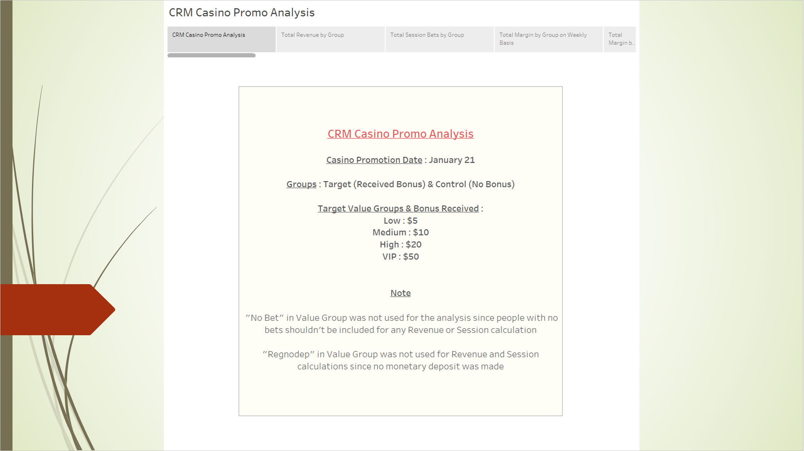
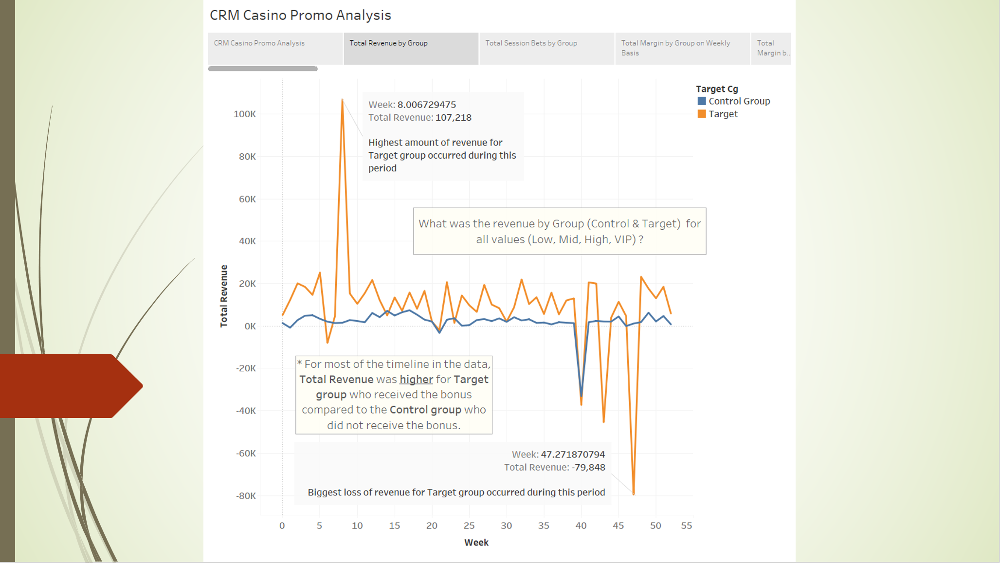
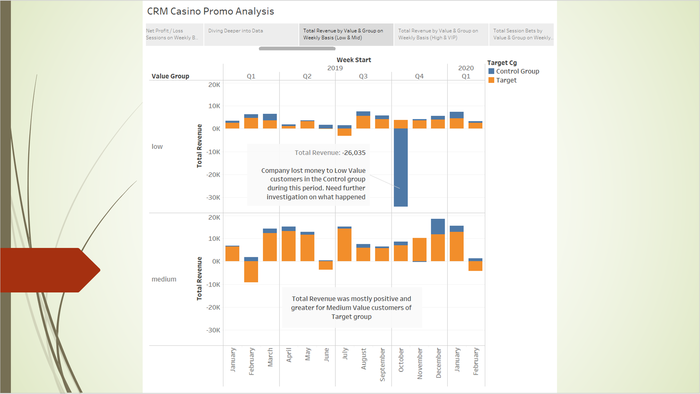
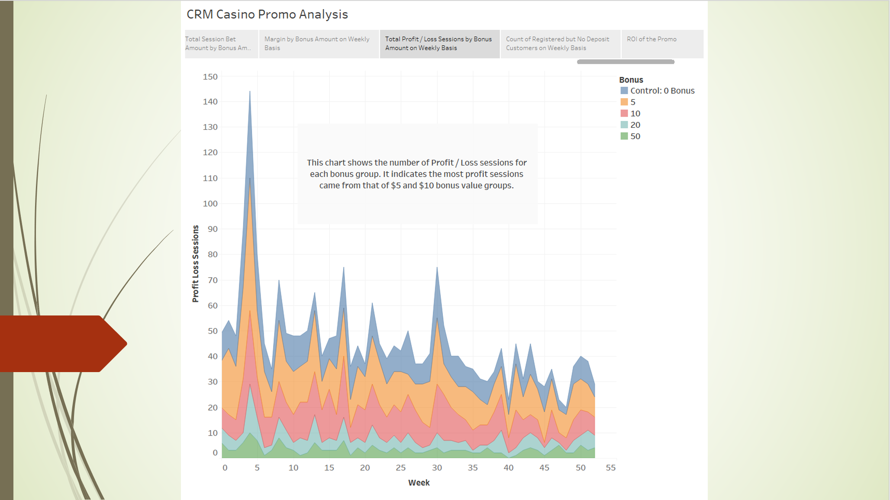

## ONLINE CASINO A/B TESTING DATA ANALYSIS USING MYSQL, TABLEAU AND POWERPOINT

### Context: We ran a CRM Casino promo on a selected target of our Casino customers on January 21st and would like to assess the impact of this promo

#### Column Fields & Description

|   FIELD    |    DESCRIPTION    |
| -----------|-------------------|
|  Playerid  |   Unique identifier for customer |
|  Handle    |   Amount wagered per session  |
|  GGR       | Gross Revenue. Formula: Stake - Winning (+ if customer lost, - if customer won)|
|Last_12months_segment| Value tier (based on last 12 months' activity)|
| Target_CG | Target / Control Group|
| Bonus | Bonus Awarded (VIP got $50, High $20, Medium $10 and Low $5) |
| Dated | Date of playing activity |

* Bonus awarded is just one for each customer

### * Raw Data Sample in MySQL

#### Data was in Excel. File was imported into MySQL

### * Using SQL, a view was created aggregated by value group and weekly activity

#### Data was ordered by year, month and week, grouped by value group (VIP, High, Medium, Low)

### * Data was then imported into and visualized using Tableau

#### This image is an example visualization of "Profit / Loss Sessions by Value Group"

### * Visualizations using Tableau were then exported to Power Point

#### * Power Point Analysis

#### * Sample Power Point Slide showing "Total Revenue by Group"

#### * Sample Power Point Slide showing "Total Revenue by Value & Group on Weekly Basis: Low & Mid)"

#### * Sample Power Point Slide showing "Total Profit / Loss Sessions by Bonus Amount on Weekly Basis"

### This was a data analysis done using Excel, MySQL, Tableau and Power Point on a sample Online Casino A/B Testing data

