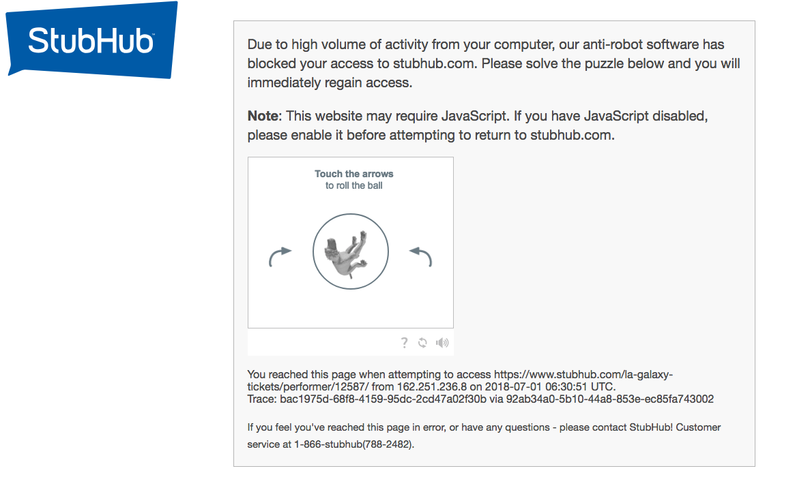
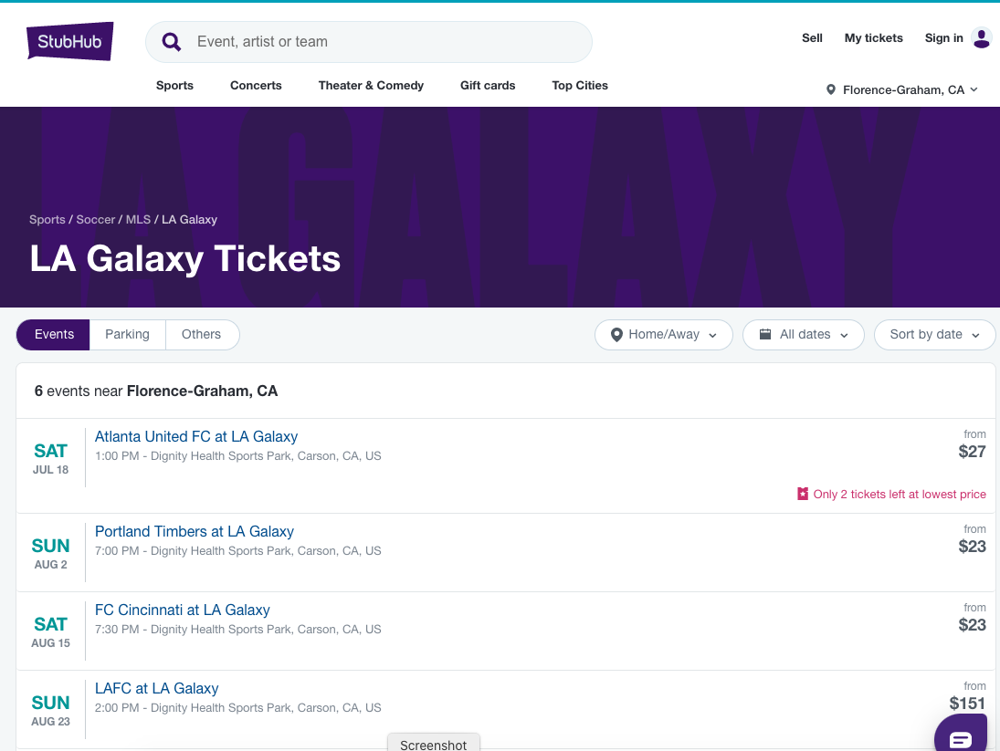
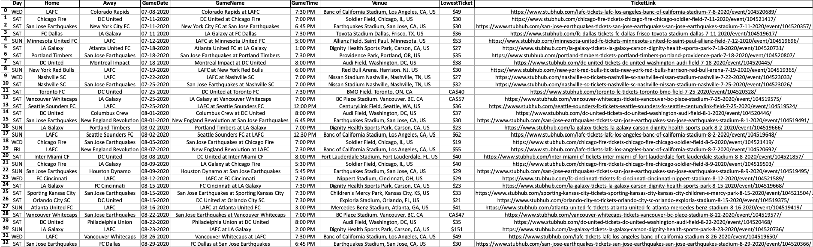

## StubHub Major League Soccer (MLS) Games Scrape

### Using Selenium Webdriver, scraped StubHub website to get some info on Major League Soccer games

### One example is Los Angeles Galaxy

Website URL : https://www.stubhub.com/la-galaxy-tickets/performer/12587/

#### When scraping, the webpage detects and puts up a human verification check similar to CAPTCHA test

#### Once human verification check is completed, the Stub Hub website showing games are displayed

#### Sample view of Stub Hub page

#### When the scraper is run, the following result is shown

#### This mini project was done just for few MLS games, but the code can be expanded to get the ticket information for those games as well
